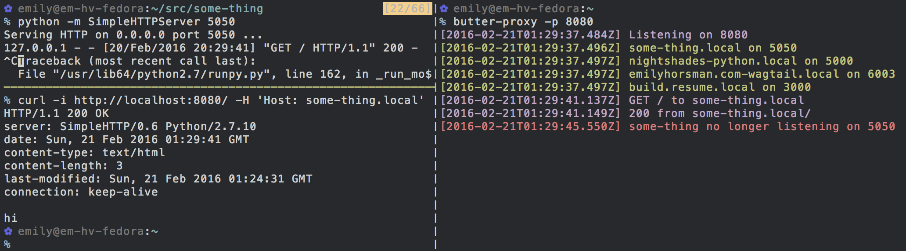

# butter-proxy

[](https://www.npmjs.com/package/butter-proxy)

```
$ npm install -g butter-proxy
$ butter-proxy
```

Uses `netstat` to automatically find running servers and then passes requests
to hosts matching the folder name of the server to the correct port.

For instance, a request to `www.resume.pxy` would be passed to port 3000
assuming a process in `~/src/resume/www` is listening on port 3000.



1. `butter-proxy` is installed and run on port 8080
2. A server is started on port 5050 in `~/src/some-thing`
3. `butter-proxy` sees the server automatically and informs us
4. A request is made with a host matching the directory, `some-thing.pxy`
5. `butter-proxy` passes the request to port 5050
6. The server on port 5050 is taken offline with a handy ^C
7. `butter-proxy` promptly informs us the host name is no longer active

## Options

* Change the port with `butter-proxy -p 8080`
* Change the base directory (what isn't included in the domain) with
  `butter-proxy -b ~/code`. By default this is `~/src`
* Change the TLD with `butter-proxy -t dev`. By default this is `pxy`
