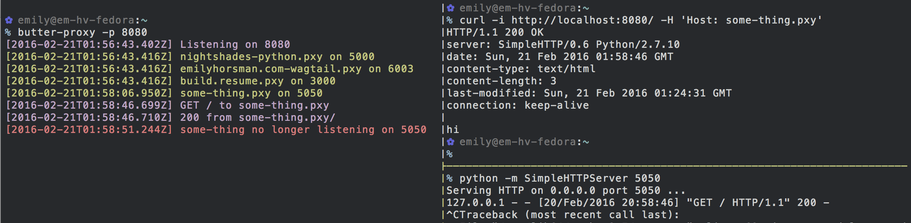

# butter-proxy

[](https://www.npmjs.com/package/butter-proxy)

```
$ npm install -g butter-proxy
$ butter-proxy
```

Uses `netstat` to automatically find running servers and then passes requests
to hosts matching the folder name of the server to the correct port.

For instance, a request to `www.resume.local` would be passed to port 3000
assuming a process in `~/src/resume/www` is listening on port 3000.



1. `butter-proxy` is installed and run on port 8080
2. A server is started on port 5050 in `~/src/some-thing`
3. `butter-proxy` sees the server automatically
4. A request is made with a host matching the directory, `some-thing.local`
5. `butter-proxy` passes the request to port 5050
